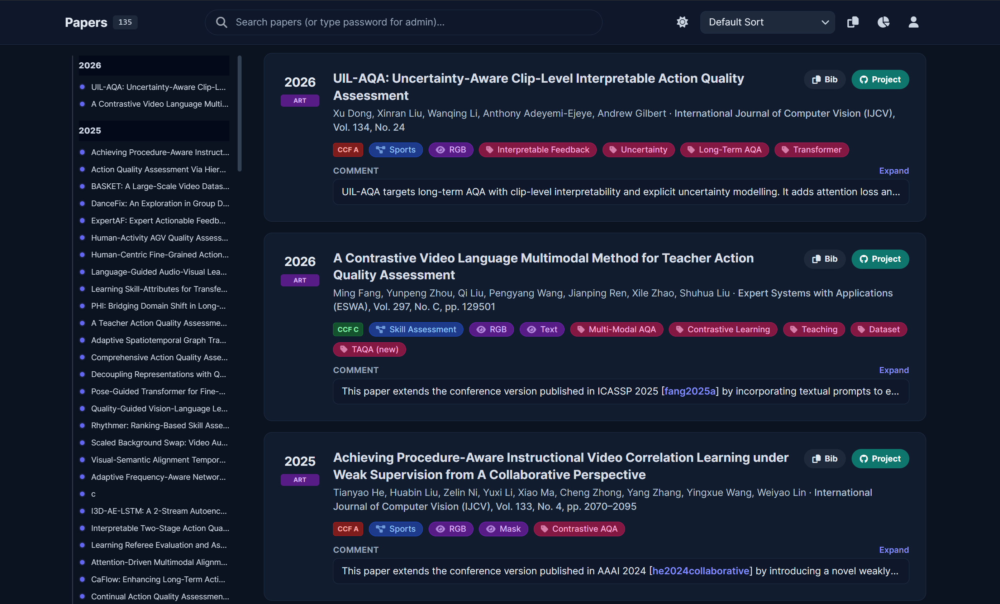

# Awesome Action Quality Assessment (AQA)

## Recommended: Survey / Project entry points
- 🔍 **Project page (keyword-friendly search):** <https://zhoukanglei.github.io/AQA-Survey> — quickly search and filter all papers/notes.
- 📘 **Bibliography bundle:** this repo ships the latest reference list; use the project page for fast discovery.

<b>Notes / Contributions / Community</b> (click to expand)

| Item | Details | Link / Image |
|---|---|---|
| Contribute | Open an issue or submit full Pull requests to add or correct papers/links. | [Issue tracker](https://github.com/ZhouKanglei/Awesome-AQA/issues) · [Pull requests](https://github.com/ZhouKanglei/Awesome-AQA/pulls) |
| WeChat group | Join via QR; if the main one expires, use the personal link. | [Main QR](imgs/aqa-wechat-group.jpg) · [Personal QR](imgs/ZKL.png) |
| Updates | Project page and issues carry the latest notes and announcements. | [Project page](https://zhoukanglei.github.io/AQA-Survey) · [Issue tracker](https://github.com/ZhouKanglei/Awesome-AQA/issues) |

## Survey list

| Venue / Year | Title | Project / Code |
|---|---|---|
|  | [A Comprehensive Survey of Action Quality Assessment: Method and Benchmark](https://zhoukanglei.github.io/AQA-Survey) (Survey, Benchmark) | [🌐](https://zhoukanglei.github.io/AQA-Survey) |
|  | [A Decade of Action Quality Assessment: Largest Systematic Survey of Trends, Challenges, and Future Directions](https://haoyin116.github.io/Survey_of_AQA/) (Survey) | [🌐](https://haoyin116.github.io/Survey_of_AQA/) |
|  | [Vision-Based Human Action Quality Assessment: A Systematic Review](https://www.sciencedirect.com/science/article/pii/S0957417424025090) (Survey) |  |
|  | [A Survey of Video-Based Action Quality Assessment](https://arxiv.org/pdf/2204.09271) (Survey) |  |
|  | [A Survey of Vision-Based Human Action Evaluation Methods](https://www.mdpi.com/1424-8220/19/19/4129) (Survey) |  |

## Reference list (sorted by year → venue → title)
Auto-compiled from the bundled bibliography. If you spot a mistake, please open an issue.

| Venue / Year | Title | Project / Code | New Dataset (modality) |
|---|---|---|---|
|  | [ProSkill: Segment-Level Skill Assessment in Procedural Videos](https://arxiv.org/abs/2601.20661) (Procedural Videos; Skill Assessment, Long-Term AQA) |  |RGB  |
|  | [MCMOE: Completing Missing Modalities with Mixture of Experts for Incomplete Multimodal Action Quality Assessment](https://github.com/XuHuangbiao/MCMoE) (Sports; Multi-Modal AQA, Incomplete Multi-Modal Learning) |  |  |
|  | [UIL-AQA: Uncertainty-Aware Clip-Level Interpretable Action Quality Assessment](https://github.com/dx199771/Interpretability-AQA) (Sports; Interpretable Feedback, Uncertainty, Long-Term AQA, Transformer) |  |  |
|  | [STAR Block: Adaptive spatio-temporal recalibration for action quality assessment](https://www.sciencedirect.com/science/article/pii/S1077314226000238) (Sports) |  |  |
|  | [SkillNet: Human Actions Assessment via Human-AI Collaboration](https://github.com/indrajeetghosh/SkillNet-Framework) (Skill Assessment; Human-AI Collaboration) |  |  |
|  | [A Contrastive Video Language Multimodal Method for Teacher Action Quality Assessment](https://github.com/MingZier/TAQA-Dataset) (Skill Assessment; Multi-Modal AQA, Contrastive Learning, Teaching) |  | TAQA RGB |
|  | [TaiChi-AQA: A Dataset and Framework for Action Quality Assessment and Visual Analysis](https://github.com/mlxger/TaiChi-AQA) (Sports) |  | TaiChi-AQA RGB |
|  | [CaFlow: Enhancing Long-Term Action Quality Assessment with Causal Counterfactual Flow](https://github.com/Harrison21/CaFlow) (Sports; Causality, Long-Term AQA) |  |  |
|  | [DanceFix: An Exploration in Group Dance Neatness Assessment through Fixing Abnormal Challenges of Human Pose](https://ojs.aaai.org/index.php/AAAI/article/view/32959) (Skill Assessment; Dance, Multi-Modal AQA) |  | DNV RGB |
|  | [Human-Activity AGV Quality Assessment: A Benchmark Dataset and an Objective Evaluation Metric](https://github.com/zczhang-sjtu/GHVQ) (Sports) |  | Human-AGVQA RGB |
|  | [BASKET: A Large-Scale Video Dataset for Fine-Grained Skill Estimation](https://github.com/yulupan00/BASKET) (Skill Assessment; Basketball) |  | BASKET RGB |
|  | [ExpertAF: Expert Actionable Feedback from Video](https://vision.cs.utexas.edu/projects/ExpertAF/) (Sports; Interpretable Feedback, Multi-Modal AQA, Foundation Model) | [🌐](https://vision.cs.utexas.edu/projects/ExpertAF/) |  |
|  | [Language-Guided Audio-Visual Learning for Long-Term Sports Assessment](https://github.com/XuHuangbiao/MLAVL) (Sports; Multi-Modal AQA, Long-Term AQA) |  |  |
|  | [Achieving Procedure-Aware Instructional Video Correlation Learning under Weak Supervision from A Collaborative Perspective](https://github.com/hotelll/Collaborative_Procedure_Alignment) (Sports; Contrastive AQA) |  |  |
|  | [Learning Skill-Attributes for Transferable Assessment in Video](https://vision.cs.utexas.edu/projects/CrossTrainer) (Skill Assessment; Multi-Modal AQA, Foundation Model) | [🌐](https://vision.cs.utexas.edu/projects/CrossTrainer) |  |
|  | [Action Quality Assessment Via Hierarchical Pose-Guided Multi-Stage Contrastive Regression](https://github.com/Lumos0507/HP-MCoRe) (Sports; Contrastive AQA) |  | FineDiving-Pose RGB |
|  | [PHI: Bridging Domain Shift in Long-Term Action Quality Assessment Via Progressive Hierarchical Instruction](https://github.com/ZhouKanglei/PHI_AQA) (Sports; Domain Shift, Long-Term AQA) |  |  |
|  | [Human-Centric Fine-Grained Action Quality Assessment](https://ieeexplore.ieee.org/document/10946879) (Sports; Multi-Modal AQA, Contrastive AQA) |  | AQA-7-HM RGB MTL-AQA-HM Mask |
|  | [A Teacher Action Quality Assessment Method Based on Label Constraint Strategy](https://ieeexplore.ieee.org/document/10888631) (Skill Assessment; Contrastive Learning, Teaching) |  | TTAQA RGB |
|  | [Decoupling Representations with Quantized Vectors for Semi-Supervised Action Quality Assessment](https://github.com/Pix0611/VQD-Net) (Sports; Semi-Supervised AQA) |  |  |
|  | [Adaptive Spatiotemporal Graph Transformer Network for Action Quality Assessment](https://github.com/jiangliu5/ASGTN_AQA) (Sports; GNN, Long-Term AQA) |  |  |
|  | [Pose-Guided Transformer for Fine-Grained Action Quality Assessment](https://ieeexplore.ieee.org/document/10946879) (Sports; Pose, Fine-Grained AQA) |  |  |
|  | [Rhythmer: Ranking-Based Skill Assessment with Rhythm-Aware Transformer](https://ieeexplore.ieee.org/document/10706745) (Skill Assessment; Ranking) |  |  |
|  | [Visual-Semantic Alignment Temporal Parsing for Action Quality Assessment](https://ieeexplore.ieee.org/document/10938403) (Sports; Multi-Modal AQA) |  |  |
|  | [Comprehensive Action Quality Assessment through Multi-Branch Modeling](https://ieeexplore.ieee.org/document/11154451) (Sports; Multi-Modal AQA) |  |  |
|  | [Quality-Guided Vision-Language Learning for Long-Term Action Quality Assessment](https://github.com/XuHuangbiao/QGVL) (Sports; Multi-Modal AQA, Long-Term AQA) |  |  |
|  | [Scaled Background Swap: Video Augmentation for Action Quality Assessment with Background Debiasing](https://github.com/Emy-cv/Scaled-Background-Swap) (Sports; Data Augmentation, Debiasing) |  |  |
|  | [Adaptive Frequency-Aware Network for Action Quality Assessment](https://github.com/han3364/MAN) (Sports; Baduanjin) |  | BDJ RGB |
|  | [Learning Referee Evaluation and Assessing Action Quality from Coarse to Fine in Diving Sport](https://www.sciencedirect.com/science/article/pii/S0925231225013360) (Sports; Diving, Contrastive AQA) |  |  |
|  | Interpretable Two-Stage Action Quality Assessment Via 3D Human Pose Estimation and Dynamic Feature Alignment (Sports; Interpretable Feedback, Pose, TaiChi) |  |  |
|  | [Scene-Aware Contrastive Regression for Multi-Person Action Quality Assessment](https://link.springer.com/article/10.1007/s10489-025-06901-8) (Sports; Contrastive AQA, Multi-Person AQA) |  | MELO RGB |
|  | [FLEX: A Large-Scale Multi-Modal Multi-Action Dataset for Fitness Action Quality Assessment](https://haoyin116.github.io/FLEX_Dataset) (Sports; Multi-Modal AQA, Weight Lifting) | [🌐](https://haoyin116.github.io/FLEX_Dataset) | FLEX RGB |
|  | [Continual Action Quality Assessment Via Adaptive Manifold-Aligned Graph Regularization](https://github.com/ZhouKanglei/MAGRPP) (Sports; Continual AQA) |  |  |
|  | [Fineskiing: A Fine-Grained Benchmark for Skiing Action Quality Assessment](https://arxiv.org/pdf/2511.10250.pdf) (Sports; Interpretable Feedback) |  | FineSkiing RGB |
|  | [SkillSight: Efficient First-Person Skill Assessment with Gaze](https://vision.cs.utexas.edu/projects/skillsight) (Skill Assessment) | [🌐](https://vision.cs.utexas.edu/projects/skillsight) |  |
|  | [Explainable Action Form Assessment by Exploiting Multimodal Chain-Of-Thoughts Reasoning](https://github.com/MICLAB-BUPT/EFA) (Sports; Interpretable Feedback, Foundation Model, Multi-Modal AQA) |  | CoT-AFA RGB |
|  | [Attention-Driven Multimodal Alignment for Long-Term Action Quality Assessment](https://arxiv.org/pdf/2507.21945) (Sports; Multi-Modal AQA, Long-Term AQA) |  |  |
|  | [Finecausal: A Causal-Based Framework for Interpretable Fine-Grained Action Quality Assessment](https://github.com/Harrison21/FineCausal) (Sports; Interpretable Feedback, Causality, Contrastive AQA) |  |  |
|  | [Vaqa-SS: Vision-Based Action Quality Assessment for Style-Based Skiing](https://doi.org/10.1016/j.displa.2025.103020) (Sports; Skiing) |  | Skiing-6 RGB |
|  | [Enhancing Long-Term Action Quality Assessment: A Dual-Modality Dataset and Causal Cross-Modal Framework for Trampoline Gymnastics](https://zenodo.org/records/16195090) (Sports; Multi-Modal AQA, Causality, Trampoline) | [🌐](https://zenodo.org/records/16195090) | Trampoline-AQA RGB |
|  | [I3D-AE-LSTM: A 2-Stream Autoencoder for Action Quality Assessment Using A Newly Created Cricket Batsman Video Dataset](https://github.com/dvanderhaar/uj-aqa-cricketvision) (Sports; Cricket) |  | UJ-AQA-CricketVision RGB |
|  | [Collaborative Weakly Supervised Video Correlation Learning for Procedure-Aware Instructional Video Analysis](https://ojs.aaai.org/index.php/AAAI/article/view/27984) (Sports; Instructional Video, Weak Supervision) |  |  |
|  | [Dancemvp: Self-Supervised Learning for Multi-Task Primitive-Based Dance Performance Assessment Via Transformer Text Prompting](https://doi.org/10.1609/aaai.v38i9.28893) (Skill Assessment; Dance, Multi-Modal AQA) |  |  |
|  | [2M-AF: A Strong Multi-Modality Framework for Human Action Quality Assessment with Self-Supervised Representation Learning](https://doi.org/10.1145/3664647.3681084) (Sports; Multi-Modal AQA, Self-Supervised) |  |  |
|  | [EgoExoLearn: A Dataset for Bridging Asynchronous Ego-And Exo-Centric View of Procedural Activities in Real World](https://github.com/OpenGVLab/EgoExoLearn) (Sports; Egocentric) |  | EgoExoLearn RGB |
|  | [FineParser: A Fine-Grained Spatio-Temporal Action Parser for Human-Centric Action Quality Assessment](https://github.com/PKU-ICST-MIPL/FineParser_CVPR2024) (Sports; Contrastive AQA) |  | FineDiving-HM |
|  | [Narrative Action Evaluation with Prompt-Guided Multimodal Interaction](https://github.com/shiyi-zh0408/NAE_CVPR2024) (Sports; Multi-Modal AQA, Narrative Action Evaluation, Video Captioning, MTL-AQA (re-annotated), FineGym (re-annotated)) |  |  |
|  | [Cofinal: Enhancing Action Quality Assessment with Coarse-to-Fine Instruction Alignment](https://github.com/ZhouKanglei/CoFInAl_AQA) (Sports; Instruction-Tuning, Domain Shift, Long-Term AQA) |  |  |
|  | [Procedure-Aware Action Quality Assessment: Datasets and Performance Evaluation](https://github.com/xujinglin/FineDiving) (Sports) |  | FineDiving+ RGB |
|  | [GAIA: Rethinking Action Quality Assessment for AI-Generated Videos](https://github.com/zijianchen98/GAIA) (Sports; AIGC AQA, Benchmark) |  | GAIA RGB |
|  | [LucidAction: A Hierarchical and Multi-Model Dataset for Comprehensive Action Quality Assessment](https://proceedings.neurips.cc/paper_files/paper/2024/file/aecf6978509d8b306f74c0d09508f9bc-Paper-Datasets_and_Benchmarks_Track.pdf) (Sports; Multi-Modal AQA, Multi-View, Curriculum Learning) |  | LucidAction RGB |
|  | [Multimodal Action Quality Assessment](https://github.com/qinghuannn/PAMFN) (Sports; Multi-Modal AQA, Audio-Visual, Fusion) |  |  |
|  | [Self-Supervised Sub-Action Parsing Network for Semi-Supervised Action Quality Assessment](https://ieeexplore.ieee.org/document/10687713) (Sports; Semi-Supervised AQA) |  |  |
|  | [EGCN++: A New Fusion Strategy for Ensemble Learning in Skeleton-Based Rehabilitation Exercise Assessment](https://doi.org/10.1109/TPAMI.2024.3378753) (Healthcare; Rehabilitation, GCN) |  |  |
|  | [EgoExo-Fitness: Towards Egocentric and Exocentric Full-Body Action Understanding](https://github.com/iSEE-Laboratory/EgoExo-Fitness) (Sports; Egocentric AQA) |  | EgoExo-Fitness RGB |
|  | [MAGR: Manifold-Aligned Graph Regularization for Continual Action Quality Assessment](https://github.com/ZhouKanglei/MAGR_CAQA) (Sports; Continual AQA, Benchmark) |  |  |
|  | [RICA2: Rubric-Informed, Calibrated Assessment of Actions](https://abrarmajeedi.github.io/rica2_aqa/) (Skill Assessment; Interpretable Feedback, Uncertainty) | [🌐](https://abrarmajeedi.github.io/rica2_aqa/) |  |
|  | [Semi-Supervised Teacher-Reference-Student Architecture for Action Quality Assessment](https://arxiv.org/pdf/2407.19675) (Skill Assessment; Semi-Supervised AQA) |  |  |
|  | [Vision-Language Action Knowledge Learning for Semantic-Aware Action Quality Assessment](https://link.springer.com/chapter/10.1007/978-3-031-72970-3_25) (Sports; Multi-Modal AQA) |  |  |
|  | [Multi-Stage Contrastive Regression for Action Quality Assessment](https://github.com/Angel-1999/MCoRe) (Sports; Contrastive AQA, Multi-Stage Modeling) |  |  |
|  | [Which Is the Better Teacher Action? A New Ranking Model and Dataset](https://github.com/MingZier/TAQR-Dataset) (Skill Assessment; Ranking, Teaching) |  |  |
|  | [Continual Action Assessment Via Task-Consistent Score-Discriminative Feature Distribution Modeling](https://github.com/iSEE-Laboratory/Continual-AQA) (Sports; Continual AQA) |  |  |
|  | [Kinematic Diversity and Rhythmic Alignment in Choreographic Quality Transformers for Dance Quality Assessment](https://doi.org/10.1109/TCSVT.2024.3360452) (Skill Assessment; Dance, Multi-Modal AQA) |  | OptiTrack RGB |
|  | [Adaptive Stage-Aware Assessment Skill Transfer for Skill Determination](https://doi.org/10.1109/TMM.2023.3294800) (Skill Assessment; Skill Transfer) |  |  |
|  | [Interpretable Long-Term Action Quality Assessment](https://github.com/dx199771/Interpretability-AQA) (Sports; Interpretable Feedback, Long-Term AQA) |  |  |
|  | [An Attention-Based Adaptive Spatial--Temporal Graph Convolutional Network for Long-Video Ergonomic Risk Assessment](https://doi.org/10.1016/j.engappai.2023.107780) (Skill Assessment; Ergonomics, GCN) |  |  |
|  | [TechCoach: Towards Technical-Point-Aware Descriptive Action Coaching](https://arxiv.org/pdf/2411.17130.pdf) (Sports; Interpretable Feedback, Action Coaching, DescCoach) |  | EE4D-DescCoach RGB |
|  | [FineRehab: A Multi-Modality and Multi-Task Dataset for Rehabilitation Analysis](https://bsu3dvlab.github.io/FineRehab) (Healthcare; Multi-Modal AQA) | [🌐](https://bsu3dvlab.github.io/FineRehab) | FineRehab RGB-D |
|  | [Hierarchical NeuroSymbolic Approach for Comprehensive and Explainable Action Quality Assessment](https://github.com/laurenok24/NSAQA) (Sports; Interpretable Feedback, Neuro-Symbolic, Diving, Temporal Segmentation, Action Recognition) |  |  |
|  | [Two-Path Target-Aware Contrastive Regression for Action Quality Assessment](https://doi.org/10.1016/j.ins.2024.120347) (Sports; Contrastive AQA) |  |  |
|  | [Auto-Encoding Score Distribution Regression for Action Quality Assessment](https://github.com/InfoX-SEU/DAE-AQA) (Sports; Uncertainty) |  |  |
|  | [An Expert-Knowledge-Based Graph Convolutional Network for Skeleton-Based Physical Rehabilitation Exercises Assessment](https://doi.org/10.1109/TNSRE.2024.3400790) (Healthcare; Rehabilitation, GCN) |  |  |
|  | [Automatic Assessment of Upper Extremity Function and Mobile Application for Self-Administered Stroke Rehabilitation](https://doi.org/10.1109/TNSRE.2024.3358497) (Healthcare; Rehabilitation, Multi-Modal AQA) |  |  |
|  | [PECoP: Parameter Efficient Continual Pretraining for Action Quality Assessment](https://github.com/Plrbear/PECoP) (Skill Assessment; Continual AQA, Parameter-Efficient Fine-Tuning, Self-Supervised Pretraining, Domain Shift, Adapter) |  | PD4T RGB |
|  | [Skating-Mixer: Long-Term Sport Audio-Visual Modeling with Mlps](https://github.com/AndyFrancesco29/Audio-Visual-Figure-Skating) (Sports; Multi-Modal AQA, Figure Skating) |  | FS1000 RGB |
|  | [A Figure Skating Jumping Dataset for Replay-Guided Action Quality Assessment](https://doi.org/10.1145/3581783.3613774) (Sports) |  | RFSJ RGB |
|  | [Localization-Assisted Uncertainty Score Disentanglement Network for Action Quality Assessment](https://github.com/yanliji/FineFS-dataset) (Sports; Multi-Modal AQA, Figure Skating) |  | FineFS RGB |
|  | [LOGO: A Long-Form Video Dataset for Group Action Quality Assessment](https://github.com/shiyi-zh0408/LOGO) (Sports; Multi-Modal AQA, Long-Term AQA, Multi-Person AQA) |  | LOGO RGB |
|  | [Automatic Modelling for Interactive Action Assessment](https://doi.org/10.1109/TNSRE.2019.2911303) (Healthcare) |  |  |
|  | [Fine-Grained Spatio-Temporal Parsing Network for Action Quality Assessment](https://doi.org/10.1109/TIP.2023.3287274) (Sports; Fine-Grained AQA) |  |  |
|  | [A Video-Based Augmented Reality System for Human-In-The-Loop Muscle Strength Assessment of Juvenile Dermatomyositis](https://hubertshum.com/publications/tvcg2023jdm/files/tvcg2023jdm.pdf) (Healthcare; Human-in-the-Loop) |  | JDM RGB |
|  | [Attention-Guided Deep Learning Framework for Movement Quality Assessment](https://doi.org/10.1109/ICASSP49357.2023.10096869) (Healthcare; Rehabilitation, Attention) |  |  |
|  | [Contrastive Self-Supervised Learning for Automated Multi-Modal Dance Performance Assessment](https://doi.org/10.1109/ICASSP49357.2023.10095863) (Skill Assessment; Multi-Modal AQA, Dance, Contrastive AQA) |  |  |
|  | [Sedskill: Surgical Events Driven Method for Skill Assessment from Thoracoscopic Surgical Videos](https://github.com/xmed-lab/SEDSkill) (Skill Assessment; Surgical AQA, Event-Driven) |  | MVR RGB |
|  | [Hierarchical Graph Convolutional Networks for Action Quality Assessment](https://github.com/ZhouKanglei/HGCN_AQA) (Sports; GCN Hierarchical Modeling) |  |  |
|  | [Learning Semantics-Guided Representations for Scoring Figure Skating](https://doi.org/10.1109/TMM.2023.3328180) (Sports; Figure Skating, Multi-Modal AQA) |  | OlympicFS RGB |
|  | [Portable Vision-Based Gait Assessment for Post-Stroke Rehabilitation Using an Attention-Based Lightweight CNN](https://doi.org/10.1016/j.eswa.2023.122074) (Healthcare; Gait Assessment, Rehabilitation) |  |  |
|  | [Improving Action Quality Assessment with Across-Staged Temporal Reasoning on Imbalanced Data](https://doi.org/10.1007/s10489-023-05133-3) (Sports; Diving, Temporal Reasoning) |  |  |
|  | [Label-Reconstruction-Based Pseudo-Subscore Learning for Action Quality Assessment in Sporting Events](https://link.springer.com/article/10.1007/s10489-022-03984-5) (Sports; Pseudo-Subscore) |  |  |
|  | [Multi-Skeleton Structures Graph Convolutional Network for Action Quality Assessment in Long Videos](https://doi.org/10.1007/s10489-022-04139-1) (Sports; Figure Skating, Skeleton AQA) |  |  |
|  | [A Contrastive Learning Network for Performance Metric and Assessment of Physical Rehabilitation Exercises](https://doi.org/10.1109/TNSRE.2023.3317411) (Healthcare; Rehabilitation, Contrastive AQA) |  |  |
|  | [A Skeleton-Based Rehabilitation Exercise Assessment System with Rotation Invariance](https://github.com/Kelly510/RehabExerAssess) (Healthcare; Rehabilitation, Rotation Invariance) |  |  |
|  | [FineDiving: A Fine-Grained Dataset for Procedure-Aware Action Quality Assessment](https://github.com/xujinglin/FineDiving) (Sports) |  | FineDiving RGB |
|  | [Likert Scoring with Grade Decoupling for Long-Term Action Assessment](https://github.com/xuangch/CVPR22_GDLT) (Sports; Long-Term AQA) |  |  |
|  | [EGCN: An Ensemble-Based Learning Framework for Exploring Effective Skeleton-Based Rehabilitation Exercise Assessment](https://github.com/bruceyo/EGCN) (Healthcare; Rehabilitation, Skeleton AQA, Ensemble) |  |  |
|  | [Adaptive Action Assessment](https://doi.org/10.1109/TPAMI.2021.3084467) (Sports; Adaptive AQA, Graph-Based AQA) |  |  |
|  | [Action Quality Assessment with Temporal Parsing Transformer](https://github.com/baiyang4/aqa_tpt) (Sports; Transformer) |  |  |
|  | [Domain Knowledge-Informed Self-Supervised Representations for Workout Form Assessment](https://github.com/ParitoshParmar/Fitness-AQA) (Sports; Self-Supervised AQA) |  | Fitness-AQA RGB |
|  | [Pairwise Contrastive Learning Network for Action Quality Assessment](https://www.ecva.net/papers/eccv_2022/papers_ECCV/papers/136640450.pdf) (Sports; Contrastive AQA) |  |  |
|  | [Surgical Skill Assessment Via Video Semantic Aggregation](http://bit.ly/MICCAI2022ViSA) (Skill Assessment; Surgical AQA, Semantic Aggregation) | [🌐](http://bit.ly/MICCAI2022ViSA) |  |
|  | [Video-Based Surgical Skills Assessment Using Long Term Tool Tracking](https://arxiv.org/pdf/2207.02247) (Skill Assessment; Surgical AQA) |  |  |
|  | [Semi-Supervised Action Quality Assessment with Self-Supervised Segment Feature Recovery](https://doi.org/10.1109/TCSVT.2022.3155319) (Sports; Semi-Supervised AQA) |  |  |
|  | [Skeleton-Based Deep Pose Feature Learning for Action Quality Assessment on Figure Skating Videos](https://doi.org/10.1016/j.jvcir.2022.103625) (Sports; Figure Skating, Pose-Based AQA) |  |  |
|  | [Skeleton-Based Action Quality Assessment Via Partially Connected LSTM with Triplet Losses](https://doi.org/10.1007/978-3-031-18916-6_18) (Sports; Tai Chi, Skeleton AQA) |  |  |
|  | [Tai Chi Action Quality Assessment and Visual Analysis with A Consumer RGB-D Camera](https://doi.org/10.1109/MMSP55362.2022.9949464) (Sports; Tai Chi) |  | TaiChi-24 RGB-D |
|  | [Graph Convolutional Networks for Assessment of Physical Rehabilitation Exercises](https://github.com/fokhruli/STGCN-rehab) (Healthcare; Rehabilitation, Skeleton AQA) |  |  |
|  | [TSA-Net: Tube Self-Attention Network for Action Quality Assessment](https://github.com/Shunli-Wang/TSA-Net) (Sports) |  | FR-FS RGB |
|  | [Aifit: Automatic 3D Human-Interpretable Feedback Models for Fitness Training](https://openaccess.thecvf.com/content/CVPR2021/papers/Fieraru_AIFit_Automatic_3D_Human-Interpretable_Feedback_Models_for_Fitness_Training_CVPR_2021_paper.pdf) (Healthcare; Interpretable Feedback, Multi-Modal AQA) |  | Fit3D RGB |
|  | [Towards Unified Surgical Skill Assessment](https://git.io/JG2OA) (Skill Assessment) | [🌐](https://git.io/JG2OA) |  |
|  | [Group-Aware Contrastive Regression for Action Quality Assessment](https://github.com/Yuxumin/CoRe) (Sports; Contrastive AQA) |  |  |
|  | [Skeleton-Based Human Action Evaluation Using Graph Convolutional Network for Monitoring Alzheimer’s Progression](https://doi.org/10.1016/j.patcog.2021.108095) (Healthcare; Rehabilitation, Alzheimer's) |  |  |
|  | [Action Quality Assessment Using Siamese Network-Based Deep Metric Learning](https://arxiv.org/pdf/2002.12096) (Sports; Siamese AQA, Metric Learning) |  |  |
|  | [Action Quality Assessment with Ignoring Scene Context](https://doi.org/10.1109/ICIP42928.2021.9506257) (Sports; Adversarial AQA, Scene-Invariant AQA) |  |  |
|  | [Learning and Fusing Multiple Hidden Substages for Action Quality Assessment](https://doi.org/10.1016/j.knosys.2021.107388) (Sports) |  |  |
|  | [Piano Skills Assessment](https://github.com/ParitoshParmar/Piano-Skills-Assessment) (Skill Assessment; Piano, Multi-Modal AQA) |  | PISA RGB |
|  | [EAGLE-EYE: Extreme-Pose Action Grader Using Detail Bird's-Eye View](https://github.com/MahdiNek/EAGLE-Eye) (Sports; Figure Skating, Gymnastics, Multi-Stream AQA) |  |  |
|  | [Hybrid Dynamic-Static Context-Aware Attention Network for Action Assessment in Long Videos](https://github.com/lingan1996/ACTION-NET) (Sports; Long-Term AQA) |  | Rhythmic Gymnastics RGB |
|  | [Uncertainty-Aware Score Distribution Learning for Action Quality Assessment](https://github.com/nzl-thu/MUSDL) (Sports; Uncertainty, Multi-Modal Score) |  |  |
|  | [An Asymmetric Modeling for Action Assessment](https://www.ecva.net/papers/eccv_2020/papers_ECCV/papers/123750222.pdf) (Sports; Asymmetric Interaction) |  | TASD-2 RGB |
|  | [Towards Accurate and Interpretable Surgical Skill Assessment: A Video-Based Method Incorporating Recognized Surgical Gestures and Skill Levels](https://github.com/gunnerwang/MTL-VF-and-IMTL-AGF) (Skill Assessment; Interpretable Feedback, Surgical AQA) |  |  |
|  | [Efficient and Robust Skeleton-Based Quality Assessment and Abnormality Detection in Human Action Performance](https://doi.org/10.1109/JBHI.2019.2922201) (Healthcare; Abnormality Detection) |  |  |
|  | [Assessing Action Quality Via Attentive Spatio-Temporal Convolutional Networks](https://doi.org/10.1007/978-3-030-63823-8_1) (Sports; Attention) |  |  |
|  | [A Deep Learning Framework for Assessing Physical Rehabilitation Exercises](https://arxiv.org/pdf/1901.10435) (Healthcare; Rehabilitation) |  |  |
|  | [The Pros and Cons: Rank-Aware Temporal Attention for Skill Determination in Long Videos](https://epic-kitchens.github.io/BEST) (Skill Assessment; Ranking) | [🌐](https://epic-kitchens.github.io/BEST) | BEST RGB |
|  | [What and How Well You Performed? A Multitask Learning Approach to Action Quality Assessment](https://github.com/ParitoshParmar/MTL-AQA) (Sports; Multitask Learning, Diving) |  | MTL-AQA RGB |
|  | [Action Assessment by Joint Relation Graphs](https://openaccess.thecvf.com/content_ICCV_2019/papers/Pan_Action_Assessment_by_Joint_Relation_Graphs_ICCV_2019_paper.pdf) (Sports; Pose, Graph) |  |  |
|  | [Manipulation-Skill Assessment from Videos with Spatial Attention Network](https://arxiv.org/pdf/1901.02579) (Skill Assessment; Attention, Manipulation) |  |  |
|  | [Surgical Skill Assessment on In-Vivo Clinical Data Via the Clearness of Operating Field](https://doi.org/10.1007/978-3-030-32245-8_53) (Healthcare; Surgical AQA) |  |  |
|  | [Learning to Score Figure Skating Sport Videos](https://github.com/loadder/MS_LSTM) (Sports; Figure Skating) |  | Fis-V RGB |
|  | [Scoringnet: Learning Key Fragment for Action Quality Assessment with Ranking Loss in Skilled Sports](https://doi.org/10.1007/978-3-030-20870-7_10) (Skill Assessment; Key Fragments) |  |  |
|  | [The Kimore Dataset: Kinematic Assessment of Movement and Clinical Scores for Remote Monitoring of Physical Rehabilitation](https://doi.org/10.1109/TNSRE.2019.2923060) (Healthcare) |  | KIMORE RGB-D |
|  | [Action Quality Assessment across Multiple Actions](http://rtis.oit.unlv.edu/datasets.html) (Sports; Multi-Action Dataset) | [🌐](http://rtis.oit.unlv.edu/datasets.html) | AQA-7 RGB |
|  | [Who's Better? Who's Best? Pairwise Deep Ranking for Skill Determination](https://arxiv.org/pdf/1703.09913) (Skill Assessment; Ranking) |  |  |
|  | [S3D: Stacking Segmental P3D for Action Quality Assessment](https://doi.org/10.1109/ICIP.2018.8451364) (Sports; Diving) |  |  |
|  | [Am I A Baller? Basketball Performance Assessment from First-Person Videos](https://arxiv.org/pdf/1611.05365) (Sports; Basketball, Egocentric AQA) |  |  |
|  | [Learning to Score Olympic Events](https://arxiv.org/pdf/1611.05125) (Sports; Diving, Vault, Figure Skating) |  |  |
|  | [Relative Hidden Markov Models for Video-Based Evaluation of Motion Skills in Surgical Training](https://doi.org/10.1109/TPAMI.2014.2361121) (Skill Assessment) |  |  |
|  | [Assessing the Quality of Actions](https://link.springer.com/chapter/10.1007/978-3-319-10599-4_36) (Sports; Diving, Vault) |  |  |
|  | [JHU-ISI Gesture and Skill Assessment Working Set (JIGSAWS): A Surgical Activity Dataset for Human Motion Modeling](https://cirl.lcsr.jhu.edu/research/hmm/datasets/jigsaws_release) (Skill Assessment) | [🌐](https://cirl.lcsr.jhu.edu/research/hmm/datasets/jigsaws_release) | JIGSAWS RGB |

Total entries: 138
